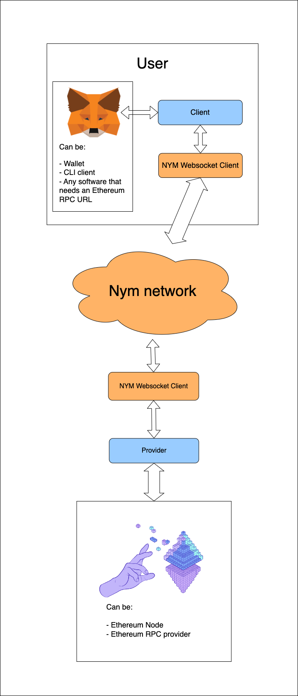

# Ethereum RPC request mixer

This proof of concept uses the Nym network to anonymize Ethereum RPC requests.

It can be used as:

- RPC URL for Metamask or other wallets to anonymize your requests (prevent real IP logging)
- local RPC for CLI utilities like [`cast`](https://book.getfoundry.sh/cast/)

## How it works

This leverages the Nym network to mix RPC requests through their network of mixnodes.

This project consists of 2 utilities:

- [`client`](client/) - receives the usual RPC requests and forwards them to the Nym network
- [`provider`](provider/) - receives the requests from the Nym network and forwards them to the Ethereum node

Each of the utilities can (and should) be run on different machines.

The Ethereum node will see the IP of the machine running the `provider` utility. The client can remain anonymous and hidden behind the Nym network. Even multiple clients can use the same `provider` utility.

The user can use a public `client` utility, but running your own is the only way to be sure that your requests are not logged.



The orange were alredy created by Nym, this repository provides the blue boxes: the `client` and the `provider`.

The `client` receives requests from the user and relays the requests through the Nym network to the `provider`, which then forwards the requests to the Ethereum node.

## Running the app

For the full system to work you will run 4 programs:

- 2 Nym clients (one for the `client` and one for the `provider`)
- the `client` which receives requests from the user
- the `provider` which relays the requests to the Ethereum node (or RPC provider)

Additionally, you need an RPC provider or an Ethereum node to forward the requests to.

### Install the Nym websocket client

You can install the [Nym websocket client](https://nymtech.net/docs/stable/integrations/websocket-client) by downloading the binary from the [releases page](https://github.com/nymtech/nym/releases) or by [building it from source](https://nymtech.net/docs/stable/run-nym-nodes/build-nym).

Once that's done, you should be able to see the help when you run:

```text
nym-client help


      _ __  _   _ _ __ ___
     | '_ \| | | | '_ \ _ \
     | | | | |_| | | | | | |
     |_| |_|\__, |_| |_| |_|
            |___/

             (client - version 1.1.4)


nym-client 1.1.4
Nymtech
Implementation of the Nym Client

USAGE:
    nym-client [OPTIONS] <SUBCOMMAND>

OPTIONS:
    -c, --config-env-file <CONFIG_ENV_FILE>
            Path pointing to an env file that configures the client

    -h, --help
            Print help information

    -V, --version
            Print version information

SUBCOMMANDS:
    completions          Generate shell completions
    generate-fig-spec    Generate Fig specification
    help                 Print this message or the help of the given subcommand(s)
    init                 Initialise a Nym client. Do this first!
    run                  Run the Nym client with provided configuration client optionally
                             overriding set parameters
    upgrade              Try to upgrade the client
```

### Set up the provider

This is the exit node of the pipeline. This is the machine that will receive the requests from the Nym network and forward them to the Ethereum node.

The `provider` utility needs to be run on a machine that can forward requests to an Ethereum node. To receive the requests from the Nym network it needs to run the [Nym websocket client](https://nymtech.net/docs/stable/integrations/websocket-client).

Once the Nym websocket client is installed, you can initialize it with the following command:

```text
nym-client init --id provider --port 3001
```

This will create a new configuration that makes the websocket client listen on port `3001` and use the `provider` identity.

The last lines of the output will be the `provider`'s address. You'll need this when you start the `client` to know who to send the messages to.

You can go ahead and start the Nym client after you created the config:

```
nym-client start --id provider
```

Now we need to start the `provider` utility.

The `provider` is located in the [`provider`](provider/) directory. You can build it with:

```text
cd provider
yarn
```

Once that's done, you need to set the `ETH_RPC_URL` environment variable to the URL of the Ethereum node you want to forward the requests to.

For example if you want to forward the requests to a local node running on `localhost:8545` you can run:

```text
ETH_RPC_URL=http://localhost8545 yarn start
```

If the Nym websocket client is on a different machine, you can set the `NYM_HOST_URL` environment variable to the host of the Nym websocket client.

By default, the `provider` will start with these values:

```text
ETH_RPC_URL=http://localhost:8545 \
NYM_HOST_URL=ws://localhost:3001 \
yarn start
```

It has sensible default values, but you need to either run a local Ethereum node or set the `ETH_RPC_URL` environment variable to the URL of the Ethereum node you want to forward the requests to.

Once it starts it displays the address the `client` should send the requests to.

```text
The exit node's address is:
CYR3uUj9vDkRvCVqZotFZwCqdhef4KP8Dk74LBVeXG7A.CZuVqwNKqjjj6yzFFmhkMm5joh1REzs6eiEfqkjT2Vtw@7Zh1Sz5dXpA6s53CbtcdqhQhLqwf4cLynL7KqHKcjrG4
You should specify this address as the target address when running the client.
```

Your provider is ready to forward requests.

### Set up the client

This is the entry node of the pipeline. This is the machine that will receive the requests from the user and forward them to the Nym network.

The `client` utility needs to send the requests to the Nym network, thus it needs to run the [Nym websocket client](https://nymtech.net/docs/stable/integrations/websocket-client).

Once the Nym websocket client is installed, you can initialize it with the following command:

```text
nym-client init --id client --port 3000
```

This will create a new configuration that makes the websocket client listen on port `3000` and use the `client` identity.

You can go ahead and start the Nym client after you created the config:

```text
nym-client start --id client
```

Now we need to start the `client` utility.

The `client` is located in the [`client`](client/) directory. You can build it with:

```text
cd client
yarn
```

The client will listen on port `8545` for Ethereum RPC requests and will relay them to the Nym network where the `provider` will receive them. You need to specify the exit node address to know where to relay these requests. This is the address that the `provider` displayed when it started.

```text
EXIT_NODE_ADDRESS={YOUR_EXIT_NODE_ADDRESS} \
yarn start
```

Similarly to the `provider`, you can set the `NYM_HOST_URL` environment variable to the host of the Nym websocket client.

By default, the `client` will start with these values:

```text
EXIT_NODE_ADDRESS={YOUR_EXIT_NODE_ADDRESS} \
NYM_HOST_URL=ws://localhost:3000 \
ETH_RPC_PORT=8545 \
yarn start
```

It has sensible default values for everything except the `EXIT_NODE_ADDRESS` which you need to specify, otherwise I won't know where to relay requests to.

## Usage

Once everything is set up you can try running a simple request to see if everything works.

For this I am using [`cast`](https://book.getfoundry.sh/cast/), which is a simple CLI utility to send Ethereum RPC requests.

On the machine running the `client` utility you can:

```text
ETH_RPC_URL=http://localhost:8545 cast block-number
```

This request will be relayed to the Nym network and forwarded to the Ethereum node running on the `provider` machine. Once the response is received it will be relayed back to the `client` and displayed.

Also works very well with Metamask.
