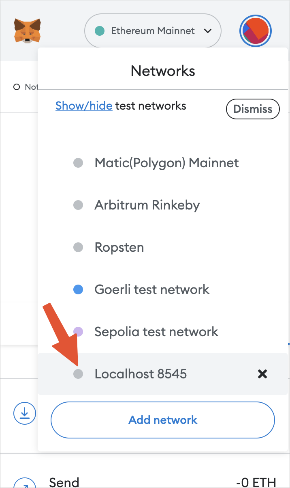

# Spook

This Ethereum RPC request mixer is a proof of concept that uses the Nym network to anonymize RPC requests.

This is useful if:

- You need to protect your real IP location of the `entry` node.
- You want to unblock yourself, if you're in a sanctioned country and you're using Metamask
- Your IP is not known by the `exit` node. Where you are in the world is not visible for anyone, it's hidden behind the Nym network.
- If the `exit` node is compromised, it does not reveal your IP address.

However, your exit node's IP address will be visible to the Ethereum node, but the `entry` node's IP address will be hidden behind the Nym network. Also, the `exit` node can censor your requests if it wants to.

You can use this as:

- RPC URL for Metamask or other wallets to anonymize your requests (prevent real IP logging, unblock sanctioned countries)
- local RPC URL for CLI utilities (like [`cast`](https://book.getfoundry.sh/cast/))

## How it works

This leverages the Nym network to mix RPC requests through their network of mix nodes.

This project consists of 2 utilities:

- [`entry`](entry/) - receives the usual RPC requests and forwards them to the Nym network
- [`exit`](exit/) - receives the requests from the Nym network and forwards them to the Ethereum node

Each of the utilities can run on different machines. If you run them on the same machine your IP is not anonymized from the Ethereum RPC provider. Between these utilities sits the Nym network, which mixes the sent packets to anonymize the requests.

The Ethereum node will see the IP of the machine running the `exit` utility. The user can remain anonymous and hidden behind the Nym network. Even multiple clients can use the same `exit` utility.

The user can use a public `entry` utility, but running your own is the only way to be sure that your requests are not logged.


The orange boxes were already created by Nym; this repository provides the blue boxes: the `entry` and the `exit`.

The `entry` receives requests from the user and relays the requests through the Nym network to the `exit`, which then forwards the requests to the Ethereum node.

## Running the app

For the full system to work, you will run 4 programs:

- 2 Nym clients (one for the `entry` and one for the `exit`)
- the `entry` which receives requests from the user
- the `exit` which relays the requests to the Ethereum node (or RPC provider)

Additionally, you need an RPC provider or an Ethereum node to forward the requests to.

A simplified example of how this can be set up is:


### Install the Nym WebSocket client

You can install the [Nym WebSocket client](https://nymtech.net/docs/stable/integrations/websocket-client) by downloading the binary from the [releases page](https://github.com/nymtech/nym/releases) or by [building it from source](https://nymtech.net/docs/stable/run-nym-nodes/build-nym).

### Set up the `exit` node

This is the exit node of the pipeline. This is the machine that will receive the requests from the Nym network and forward them to the Ethereum node.

The `exit` utility needs to be run on a machine that can forward requests to an Ethereum node. To receive the requests from the Nym network, it needs to run the [Nym WebSocket client](https://nymtech.net/docs/stable/integrations/websocket-client).

Once the Nym WebSocket client is installed, you can initialize it with the following command:

```text
nym-client init --id exit-node --port 3001
```

This will create a new configuration that makes the WebSocket client listen on port `3001` and use the `exit-node` identity.

The last lines of the output will be the `exit-node`'s address. You'll need this when you start the `entry` to know to who to send the messages.

You can go ahead and start the Nym client after you create the config:

```
nym-client start --id exit-node
```

Now we need to start the `exit` utility.

The `exit` is located in the [`exit`](exit/) directory. You can build it with the following:

```text
cd provider
yarn
```

Once that's done, you need to set the `ETH_RPC_URL` environment variable to the URL of the Ethereum node you want to forward the requests.

For example, if you want to forward the requests to a local node running on `https://eth.llamarpc.com` you can set the `ETH_RPC_URL` environment variable to:

```text
export ETH_RPC_URL=https://eth.llamarpc.com
```

To set the `NYM_HOST_URL` environment variable to the URL of the Nym WebSocket client, by default this has the value:

```text
export NYM_HOST_URL=ws://localhost:3001
```

If the Nym WebSocket client is on a different machine, you can set the `NYM_HOST_URL` environment variable to the host of the Nym WebSocket client.

Bringing this together you can set the environment variables and start the `exit` utility with:

```text
export ETH_RPC_URL=https://eth.llamarpc.com
export NYM_HOST_URL=ws://localhost:3001
yarn start
```

Once it starts, it displays the address to which the `entry` should send the requests.

```text
The exit node's address is:
CYR3uUj9vDkRvCVqZotFZwCqdhef4KP8Dk74LBVeXG7A.CZuVqwNKqjjj6yzFFmhkMm5joh1REzs6eiEfqkjT2Vtw@7Zh1Sz5dXpA6s53CbtcdqhQhLqwf4cLynL7KqHKcjrG4
You should specify this address as the target address when running the entry utility.
```

Your exit utility is ready to make requests to the Ethereum RPC provider.

### Set up the `entry` node

This is the entry node of the pipeline. This is the machine that will receive the requests from the user and forward them to the Nym network.

The `entry` utility needs to send the requests to the Nym network. Thus it needs to run the [Nym WebSocket client](https://nymtech.net/docs/stable/integrations/websocket-client).

Once the Nym WebSocket client is installed, you can initialize it with the following command:

```text
nym-client init --id entry-node --port 3000
```

This will create a new configuration that makes the WebSocket client listen on port `3000` and use the `entry-node` identity.

You can go ahead and start the Nym client after you create the config:

```text
nym-client start --id entry-node
```

Now we need to start the `entry` utility.

The `entry` is located in the [`entry`](entry/) directory. You can build it with the following:

```text
cd entry
yarn
```

The `entry` utility will listen on port `8545` for Ethereum RPC requests and will relay them to the Nym network, where the `exit` will receive and process them. You need to specify the exit node address to know where to relay these requests. This is the address that the `exit` displayed when it started.

```text
export EXIT_NODE_ADDRESS={YOUR_EXIT_NODE_ADDRESS}
```

To set the `NYM_HOST_URL` environment variable to the URL of the Nym WebSocket client, by default this has the value:

```text
export NYM_HOST_URL=ws://localhost:3000
```

Bringing this together you set the exit node's address and can also specify a different Nym WebSocket client host and start the `entry` utility with:

```text
export EXIT_NODE_ADDRESS={YOUR_EXIT_NODE_ADDRESS}
export NYM_HOST_URL=ws://localhost:3000
yarn start
```

Once this started you should have 4 terminals running:

- 1 Nym WebSocket client on the `exit` node
- 1 `exit` utility
- 1 Nym WebSocket client on the `entry` node
- 1 `entry` utility

## Usage

### Cast

Once everything is set up, you can try running a simple request to see if everything works.

For this, I am using [`cast`](https://book.getfoundry.sh/cast/), which is a simple CLI utility to send Ethereum RPC requests.

On the machine running the `entry` utility, you can:

```text
ETH_RPC_URL=http://localhost:8545 cast block-number
```

This request will be relayed to the Nym network and forwarded to the Ethereum node running on the `exit` machine. Once the response is received, it will be relayed back to the `entry` and displayed.

### Metamask

Also works seamlessly with Metamask.

Once you set everything up and the entry utility is running on your local machine, just change Metamask to use the local RPC.



You can use Metamask as you normally would, but the requests will be relayed through the Nym network.
